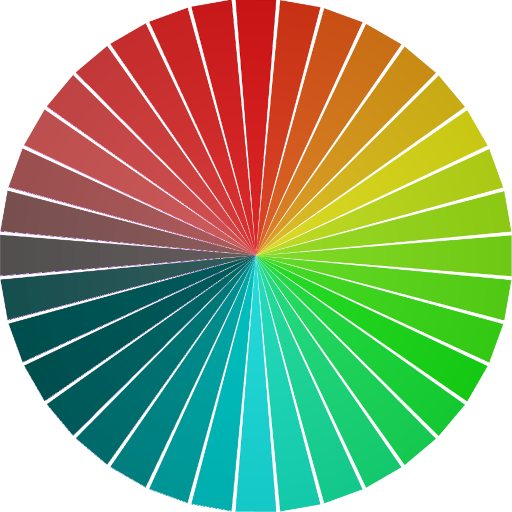

    

    

Color Screen is an application for simulating arbitrary regions of your screen as someone with various types of colorblindness would see it. This can be used to check presentations, scientific figures, etc. to make sure they are legible to everyone!

    <Video controls src="./images/colorscreen_demo.webm" align="center" width="620px">

The program is written in Python with the GUI created using PyQt5, which I believe is cross platform. As of now, I have only tested the program on linux, but I will work on creating releases that are stable for both Windows and Mac once I work out some of the kinks!

### Installation

So far, I only have a working installation process on Linux, but I am working on both Windows and Mac now!

To install for Linux, head over to the [releases](https://github.com/Jfeatherstone/ColorScreen/releases) page, and follow the instructions! I've posted a version with all of the dependencies packaged with the script (pretty large file) or just the python file (so you may have to resolve some dependencies; listed below).

If there are any issues with installation, or bugs with the program in general, please let me know!

### Dependencies

- PyQt5
- numpy
- Pillow
- pyautogui

To run the program, clone the repo and run the `MainWindow.py` file. This should open up a window that you can resize and move around your screen. Press the `Refresh` button to simulate the selected region with the desired type of dichromacy.

### Color Blindness Simulation

The application is currently able to simulate the three different types of dichromacy:

- Protanopia
- Deuteranopia
- Tritanopia

The simulation method was taken from [here](https://ixora.io/projects/colorblindness/color-blindness-simulation-research/), which outlines all of the variations in terms of their respective transformation matrices. I am by no means an expert on this very complicated subject, and don't claim to have any understanding that isn't presented in the above site. Comparing the results of my implementation with other sites/methods has gives good results, but the simulations should be taken as approximate regardless.

If you're interested in testing out the transformation method, feel free to check out `TransformTest.ipynb`, which gives a demo of how it works

### Credits

- Icon is an edited version of [DavidZydd](https://pixabay.com/users/davidzydd-985081/)'s image on Pixabay

- Transform method taken from [Jim](https://ixora.io/about-me/)
